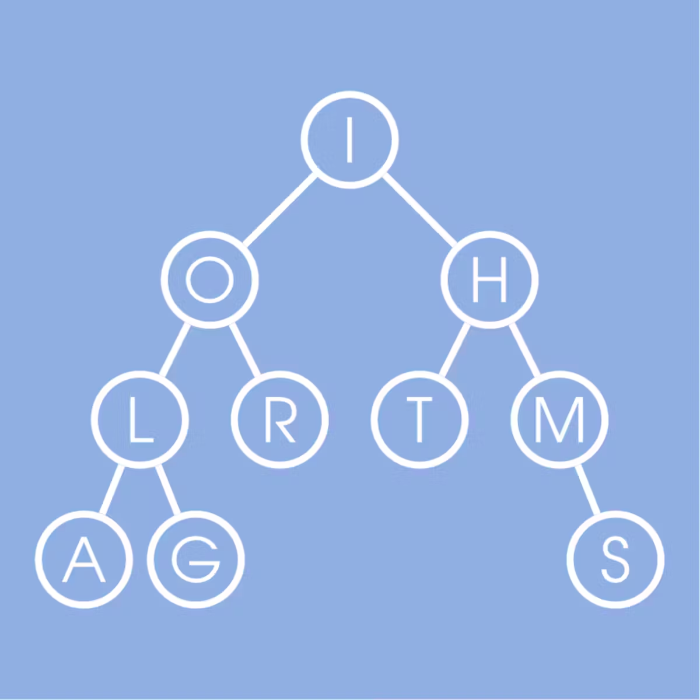

# coursera_Data-Structures-and-Algorithms-Specialization
Computer science legend Donald Knuth once said “I don’t understand things unless I try to program them.” 
We also believe that the best way to learn an algorithm is to program it. 
However, many excellent books and online courses on algorithms, that excel in introducing algorithmic ideas, 
have not yet succeeded in teaching you how to implement algorithms, 
the crucial computer science skill that you have to master at your next job interview. 
We tried to fill this gap by forming a diverse team of instructors that includes world-leading experts in theoretical and applied algorithms at UCSD 
(Daniel Kane, Alexander Kulikov, and Pavel Pevzner), a chief data scientist at Yandex (Michael Levin), 
and a former software engineer at Google (Neil Rhodes). This unique combination of skills makes this Specialization different from other excellent MOOCs on algorithms that are all developed by theoretical computer scientists. While these MOOCs focus on theory, our Specialization is a mix of algorithmic theory/practice/applications with software engineering. You will learn algorithms by implementing nearly 100 coding problems in a programming language of your choice. To the best of knowledge, no other online course in Algorithms comes close to offering you a wealth of programming challenges (and puzzles!) that you may face at your next job interview. We invested over 3000 hours into designing our challenges as an alternative to multiple choice questions that you usually find in MOOCs. 

## Instructors
[Daniel M Kane](https://cseweb.ucsd.edu/~dakane/)

[Alexander Kulikov](https://alexanderskulikov.github.io/)

[Pavel Pevzner](https://bioalgorithms.ucsd.edu/)

[Michael Levin](https://www.linkedin.com/in/michael-levin-5625aa58/)

[Neil Rhodes](https://www.cs.hmc.edu/~rhodes/)

## Offered by
UNIVERSITY OF CALIFORNIA SAN DIEGO and HSE UNIVERSITY

# [About this Specialization](https://www.coursera.org/specializations/data-structures-algorithms?)

 
 

## There are 6 Courses in this Specialization
### [Algorithmic Toolbox](https://www.coursera.org/learn/algorithmic-toolbox?specialization=data-structures-algorithms)
The course covers basic algorithmic techniques and ideas for computational problems arising frequently in practical applications: sorting and searching, divide and conquer, greedy algorithms, dynamic programming. We will learn a lot of theory: how to sort data and how it helps for searching; how to break a large problem into pieces and solve them recursively; when it makes sense to proceed greedily; how dynamic programming is used in genomic studies. You will practice solving computational problems, designing new algorithms, and implementing solutions efficiently (so that they run in less than a second).

### [Data Structures](https://www.coursera.org/learn/data-structures?specialization=data-structures-algorithms)
A good algorithm usually comes together with a set of good data structures that allow the algorithm to manipulate the data efficiently. In this course, we consider the common data structures that are used in various computational problems. You will learn how these data structures are implemented in different programming languages and will practice implementing them in our programming assignments. This will help you to understand what is going on inside a particular built-in implementation of a data structure and what to expect from it. You will also learn typical use cases for these data structures.

A few examples of questions that we are going to cover in this class are the following:
1. What is a good strategy of resizing a dynamic array?
2. How priority queues are implemented in C++, Java, and Python?
3. How to implement a hash table so that the amortized running time of all operations is O(1) on average?
4. What are good strategies to keep a binary tree balanced? 

You will also learn how services like Dropbox manage to upload some large files instantly and to save a lot of storage space!

### [Algorithms on Graphs](https://www.coursera.org/learn/algorithms-on-graphs?specialization=data-structures-algorithms)
If you have ever used a navigation service to find optimal route and estimate time to destination, you've used algorithms on graphs. Graphs arise in various real-world situations as there are road networks, computer networks and, most recently, social networks! If you're looking for the fastest time to get to work, cheapest way to connect set of computers into a network or efficient algorithm to automatically find communities and opinion leaders in Facebook, you're going to work with graphs and algorithms on graphs.

In this course, you will first learn what a graph is and what are some of the most important properties. Then you'll learn several ways to traverse graphs and how you can do useful things while traversing the graph in some order. We will then talk about shortest paths algorithms — from the basic ones to those which open door for 1000000 times faster algorithms used in Google Maps and other navigational services. You will use these algorithms if you choose to work on our Fast Shortest Routes industrial capstone project. We will finish with minimum spanning trees which are used to plan road, telephone and computer networks and also find applications in clustering and approximate algorithms.

### [Algorithms on Strings](https://www.coursera.org/learn/algorithms-on-strings?specialization=data-structures-algorithms)
World and internet is full of textual information. We search for information using textual queries, we read websites, books, e-mails. All those are strings from the point of view of computer science. To make sense of all that information and make search efficient, search engines use many string algorithms. Moreover, the emerging field of personalized medicine uses many search algorithms to find disease-causing mutations in the human genome.

### [Advanced Algorithms and Complexity](https://www.coursera.org/learn/advanced-algorithms-and-complexity?specialization=data-structures-algorithms)
You've learned the basic algorithms now and are ready to step into the area of more complex problems and algorithms to solve them. Advanced algorithms build upon basic ones and use new ideas. We will start with networks flows which are used in more typical applications such as optimal matchings, finding disjoint paths and flight scheduling as well as more surprising ones like image segmentation in computer vision. We then proceed to linear programming with applications in optimizing budget allocation, portfolio optimization, finding the cheapest diet satisfying all requirements and many others. Next we discuss inherently hard problems for which no exact good solutions are known (and not likely to be found) and how to solve them in practice. We finish with a soft introduction to streaming algorithms that are heavily used in Big Data processing. Such algorithms are usually designed to be able to process huge datasets without being able even to store a dataset.

### [Genome Assembly Programming Challenge](https://www.coursera.org/learn/assembling-genomes?specialization=data-structures-algorithms)
In Spring 2011, thousands of people in Germany were hospitalized with a deadly disease that started as food poisoning with bloody diarrhea and often led to kidney failure. It was the beginning of the deadliest outbreak in recent history, caused by a mysterious bacterial strain that we will refer to as E. coli X. Soon, German officials linked the outbreak to a restaurant in Lübeck, where nearly 20% of the patrons had developed bloody diarrhea in a single week. At this point, biologists knew that they were facing a previously unknown pathogen and that traditional methods would not suffice – computational biologists would be needed to assemble and analyze the genome of the newly emerged pathogen.

To investigate the evolutionary origin and pathogenic potential of the outbreak strain, researchers started a crowdsourced research program. They released bacterial DNA sequencing data from one of a patient, which elicited a burst of analyses carried out by computational biologists on four continents. They even used GitHub for the project: https://github.com/ehec-outbreak-crowdsourced/BGI-data-analysis/wiki

The 2011 German outbreak represented an early example of epidemiologists collaborating with computational biologists to stop an outbreak. In this Genome Assembly Programming Challenge, you will follow in the footsteps of the bioinformaticians investigating the outbreak by developing a program to assemble the genome of the E. coli X from millions of overlapping substrings of the E.coli X genome.
